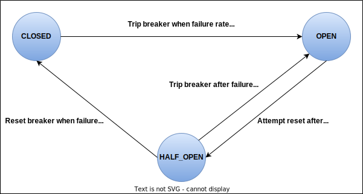

# edge-service

Edge servers are applications at the edge of a system that implement aspects like API gateways and cross-cutting concerns.

### The architecture of the Bookshop system after adding Edge Service and Redis.

We will use the Spring Cloud Gateway to build the Edge Service application and implement an API gateway and also use it as a central place to handle
cross-cutting concerns, such as Security, Monitoring, and Resilience.

An API gateway provides an entry point to the system. In distributed systems like microservices, that's a convenient way to decouple the clients from any
changes to the internal services' APIs. You're free to change how your system is decomposed into services and their APIs, relying on the fact that the gateway
can translate from a more stable, client-friendly, public API to the internal one.

However, it's important to remember that an edge server adds complexity to the system. It's another component to build, deploy, and manage in production.
It also adds a new network hop to the system, so the response time will increase. That's usually an insignificant cost, but you should keep it in mind.
Since the edge server is the entry point to the system, it's at risk of becoming a single point of failure. As a basic mitigation strategy, you should deploy
at least two replicas of an edge server.

Spring Cloud Gateway provides three main building blocks:
* **Route**: This is identified by a unique ID, a collection of predicates for deciding whether to follow the route, a URI for forwarding the request if the
predicates allow, and a collection of filters that are applied either before or after forwarding request downstream.
* **Predicate**: This matches anything from the HTTP request, including path, host, headers, query parameters, cookies and body.
* **Filter**: This modifies an HTTP request or response before or after forwarding the request to the downstream service.

Requests are matched against predicates, filtered, and finally forwarded to the downstream service, which replies with a response that goes through
another set of filters before being returned to the client.

By default, the Netty HTTP client used by Spring Cloud Gateway is configured with an elastic connection pool to increase the number of concurrent connections
dynamically as the workload increases. Depending on the number of requests your system receives simultaneously, you might want to switch to a fixed connection
pool, so you have more control over the number of connections.

#### Processing requests and responses through filters
Routes and predicate alone make the application act as a proxy, but it's filter that make Spring Cloud Gateway really powerful.

Pre-filters can run before forwarding incoming requests to a downstream application. They can be used for:
* Manipulating the request headers.
* Applying rate limiting and circuit breaking.
* Defining retries and timeouts for the proxied requests.
* Triggering an authentication flow with OAuth2 and OpenID Connect.

Post-filters can apply to outgoing responses after they are received from the downstream application and before sending them back to the client.
They can be used for:
* Setting security headers.
* Manipulating the response body to remove sensitive information.

Spring Cloud Gateway comes bundled with many filters that you can use to perform different actions, including adding headers to a request, configuring a
circuit breaker, saving the web session, retrying the request on failure, or activating a rate limiter.

##### Using the retry filter
We want to define retry attempts for all GET requests whenever the error is in the 5xx range (SERVER_ERROR). We don't want to retry requests when the error
is in the 4xx range. We can also list the exceptions for which a retry should be attempted, such as IOException and TimeoutException.
You shouldn't keep retrying requests one after the other. You should use backoff strategy instead. By default, the delay is computed using the formula
firstBackoff * (factor ^ n). If you set the basedOnPreviousValue parameter to true, the formula will be prevBackoff * factor.

#### Fault tolerance with Spring Cloud Circuit Breaker and Resilience4J
The retry pattern is useful when a downstream service is momentarily unavailable. But what if it stays down for more than a few instants? At that point we
could stop forwarding requests to it until we're sure that it's back. Continuing to send requests won't be beneficial for the caller or the callee. In that
scenario, the circuit breaker pattern comes in handy.

Resilience is a critical property of cloud native applications. One of the principles for achieving resilience is blocking a failure from cascading and
affecting other components. Consider a distributed system where application X depends on application Y. If application Y fails, will application X fail, too?
A circuit breaker can block a failure in one component from propagating to the others depending on it, protecting the rest of the system. That is accomplished
by temporarily stopping communication with the faulty component until it recovers.

In the world of distributed systems, you can establish circuit breakers at the integration points between components. Think about Edge Service and Catalog
Service. In a typical scenario, the circuit is closed, meaning that the two services can interact over the network. For each server error response returned by
Catalog Service, the circuit breaker in Edge Service would register the failure. When the number of failures exceeds a certain threshold, the circuit breaker
trips, and the circuit transitions to open.

While the circuit is open, communications between Edge Service and Catalog Service are not allowed. Any request that should be forwarded to Catalog Service
will fail right away. In this state, either an error is returned to the client, or fallback logic is executed. After an appropriate amount of time to permit
the system to recover, the circuit breaker transitions to a half-open state, allowing the next call to Catalog Service to go through. That is an exploratory
phase to check if there are still issues in contacting the downstream service. If the call succeeds, the circuit breaker is reset and transitions to closed.
Otherwise, it goes back to being open.

A circuit breaker ensures fault tolerance when a downstream service exceeds the maximum number of failures allowed by blocking any communication between
upstream and downstream services. The logic is based on three states: closed, open, and half-open.
